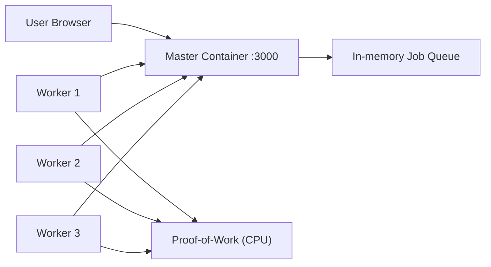

# Distributed Task Processor - Full Project Explanation (Viva Ready)

## 1. Project Overview

This project demonstrates a **distributed computing system** using a **Master/Worker architecture**.

- The **Master Node** exposes APIs and a dashboard.
- Multiple **Worker Nodes** pull jobs from the master, execute CPU-heavy work, and submit results.
- The full stack is containerized with Docker and orchestrated using Docker Compose.
- CI/CD and quality checks are automated with Jenkins + SonarQube.

This setup is useful to show core DevOps and distributed-system concepts:
- service decomposition
- horizontal scaling (multiple workers)
- inter-container networking
- automated quality gating before deployment

---

## 2. Repository Structure and What Each Part Does

### Core distributed app (used in Docker + pipeline)
- `master/`  
  Master API + dashboard UI.
- `worker/`  
  Worker process that polls and computes jobs.
- `Dockerfile.master`  
  Builds the master container.
- `Dockerfile.worker`  
  Builds the worker container.
- `docker-compose.yml`  
  Runs one master and worker service replicas on a shared network.
- `sonar-project.properties`  
  SonarQube scan config for `master` and `worker`.
- `Jenkinsfile`  
  CI/CD pipeline.

### Additional app track in repo (not the one deployed by current compose)
- `backend/` and `frontend/`  
  A separate API health-monitor application with Jest tests (`backend/tests/server.test.js`).

If asked: **current Docker/Jenkins pipeline deploys the `master/worker` distributed system**, not the `backend/frontend` monitor app.

---

## 3. Runtime Architecture

### Networking details
- Docker Compose creates `task-network` (bridge).
- Service discovery uses Docker DNS:
  - worker reaches master by hostname `master`
  - `MASTER_URL=http://master:3000`
- Host exposes only master UI/API on `localhost:3000`.

---

## 4. Master Node Code Walkthrough (`master/server.js`)

Main responsibilities:
1. host static dashboard (`master/public`)
2. expose job APIs
3. maintain in-memory queue/state

### Important APIs
- `GET /api/jobs`  
  Returns stats + latest jobs (up to 50).
- `POST /api/jobs`  
  Creates new job with default difficulty 4.
- `GET /api/jobs/acquire?workerId=...`  
  Worker pulls a pending job; job status changes to `PROCESSING`.
- `POST /api/jobs/complete`  
  Worker submits result; status changes to `COMPLETED`.

### Data model per job
- `id`, `status`
- `difficulty`
- `workerId`
- `result`
- timestamps: `createdAt`, `startedAt`, `completedAt`

### Design note
Queue is in-memory (`let jobs = []`), so restart clears state.  
This is acceptable for demo/academic use and easy to explain.

---

## 5. Worker Node Code Walkthrough (`worker/index.js`)

Worker flow:
1. Generate unique worker id.
2. Poll master `/api/jobs/acquire`.
3. If job exists, run Proof-of-Work:
   - brute-force `nonce`
   - compute `SHA256(jobId + nonce)`
   - success when hash starts with `difficulty` number of leading zeros.
4. Submit hash to `/api/jobs/complete`.
5. Repeat.

Polling behavior:
- fast re-poll (`100 ms`) after successful completion
- slow re-poll (`2000 ms`) if no work
- longer backoff (`5000 ms`) on communication errors

Why this matters:
- shows asynchronous workers
- demonstrates independent failure/retry behavior
- demonstrates parallel processing when replicas > 1

---

## 6. Frontend Dashboard (`master/public/*`)

UI components:
- Stats cards: total, pending, processing, completed
- Jobs table: id, status, difficulty, worker, result hash, duration
- Button: "Deploy 10 Jobs"

Behavior (`script.js`):
- polls `/api/jobs` every 1 second
- creates 10 jobs by repeated `POST /api/jobs`
- computes and displays duration for completed jobs

Purpose:
- visual proof that multiple workers consume queue in parallel

---

## 7. Docker Setup and Why It Is Written This Way

## `Dockerfile.master`
- base: `node:18-alpine` (small image)
- installs master dependencies
- exposes port `3000`

## `Dockerfile.worker`
- base: `node:18-alpine`
- installs worker dependencies
- starts worker script

## `docker-compose.yml`
- service `master`: builds master image and publishes port `3000:3000`
- service `worker`: builds worker image and depends on master
- shared bridge network `task-network`
- replica intent is expressed under `deploy.replicas: 3` (works best with swarm; in plain compose many setups use `--scale worker=3`)

Why Docker here:
- reproducible environment
- clean service isolation
- easy multi-instance simulation on one machine

---

## 8. SonarQube Integration

File: `sonar-project.properties`

- `sonar.sources=master,worker`
- excludes `node_modules` and CSS noise path
- project key: `task-processor`

What Sonar gives:
- static quality analysis
- code smell and reliability/security checks
- quality gate decision before deploy

Observed warning:
- `sonar.login` is deprecated in favor of `sonar.token`
- pipeline still works, but migration is recommended.

---

## 9. Jenkins Pipeline - Stage by Stage (`Jenkinsfile`)

## Stage 1: Checkout
- pulls code from GitHub branch (`main`)

## Stage 2: SonarQube Analysis
- loads scanner tool
- injects Sonar env (`withSonarQubeEnv('sonar-server')`)
- runs `sonar-scanner.bat`

## Stage 3: Quality Gate Check
- first tries Jenkins `waitForQualityGate`
- if plugin runtime issue occurs, fallback script:
  - reads `.scannerwork/report-task.txt`
  - polls Sonar CE task API
  - retrieves analysisId
  - checks `/api/qualitygates/project_status`
  - fails build if gate status is not `OK`

Why fallback was added:
- your Jenkins Sonar plugin path had intermittent URL handling issue during `waitForQualityGate`.
- fallback keeps gate enforcement reliable.

## Stage 4: Docker Build & Deploy
- runs `docker compose up -d --build`
- builds latest images and starts cluster

Post actions:
- always prints completion
- success/failure logs outcome

---

## 10. End-to-End Flow (What Happens After You Click Build)

1. Jenkins pulls latest commit.
2. Sonar scanner analyzes source and uploads report.
3. Quality gate must pass.
4. Docker images build.
5. Master + workers start.
6. User opens dashboard and deploys jobs.
7. Workers process queue concurrently.

---

## 11. Likely Professor Questions and Strong Answers

## Q1: Why Master/Worker?
A: It decouples request intake from heavy processing, enables horizontal scaling, and improves responsiveness.

## Q2: Why use polling instead of push/message queue?
A: Polling is simple for demonstration. In production, Redis/RabbitMQ/Kafka would reduce idle polling overhead and improve reliability.

## Q3: What happens if master restarts?
A: In-memory jobs are lost. Persistent storage/message broker is needed for durability.

## Q4: How do workers find master?
A: Docker DNS resolves service name `master` on shared bridge network.

## Q5: How is quality enforced before deployment?
A: SonarQube analysis + quality gate check in Jenkins blocks deploy if gate fails.

## Q6: Why containerize both services?
A: Isolation, reproducibility, consistent runtime, and easy scaling.

## Q7: How do you scale workers?
A: Increase worker replicas (`--scale worker=N` or orchestration equivalent).

## Q8: What are current limitations?
A:
- no persistent queue/database
- no auth on APIs
- no centralized logs/metrics
- potential duplicate work under race conditions in simple in-memory design

---

## 12. Improvements You Can Mention as Future Work

1. Replace in-memory queue with Redis/RabbitMQ.
2. Store completed jobs in PostgreSQL/MongoDB.
3. Add auth/rate limiting for APIs.
4. Add Prometheus + Grafana dashboards.
5. Add unit/integration tests for master/worker paths.
6. Add rollback strategy and environment separation (dev/stage/prod).
7. Move to Kubernetes for richer scaling and health checks.

---

## 13. Quick Demo Script for Viva

1. Show Jenkins pipeline stages and successful run.
2. Open Sonar dashboard and quality gate status.
3. Show `docker ps` with master + workers.
4. Open `http://localhost:3000`.
5. Click "Deploy 10 Jobs".
6. Explain pending -> processing -> completed transitions.
7. Show worker logs to prove parallel execution.

---

## 14. Key Talking Point (30-second Summary)

"This is a containerized distributed task-processing system using a master/worker pattern. Jenkins automates checkout, static analysis through SonarQube, quality-gate enforcement, and Docker deployment. The master exposes APIs and dashboard, while multiple worker containers process CPU-heavy jobs in parallel over an internal Docker network. The project demonstrates practical DevOps, CI/CD, and distributed-system fundamentals with clear scaling and quality-control mechanisms."
